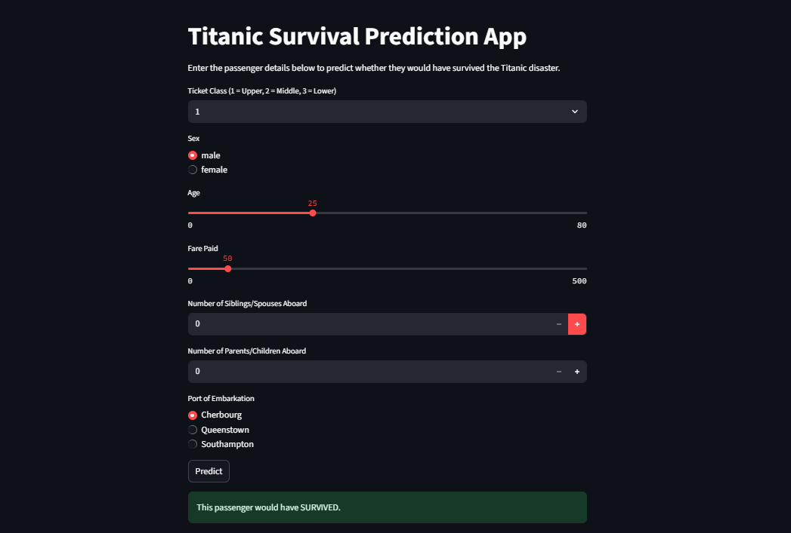
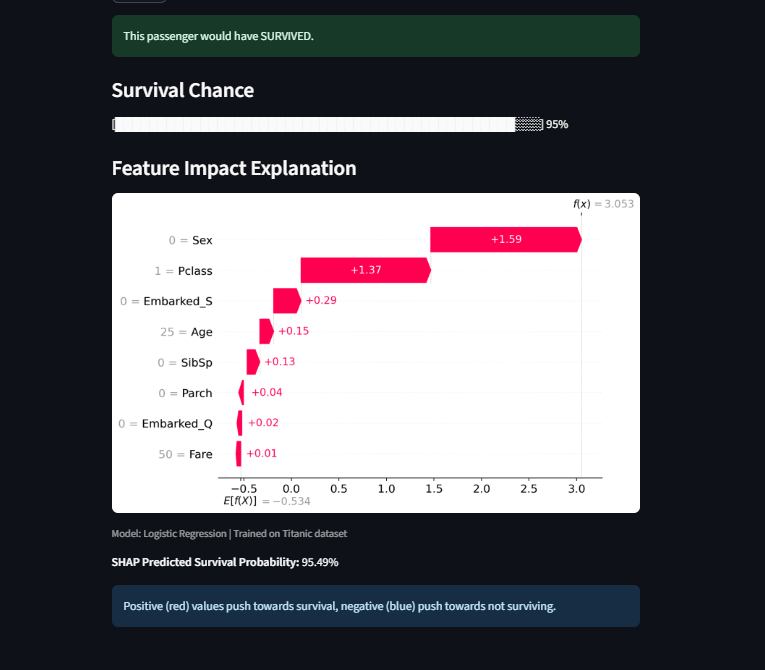

# 🚢 Titanic Survival Prediction App

This is a machine learning-powered web app built with **Streamlit** that predicts whether a passenger would have survived the Titanic disaster based on their personal information.

---

## ✨ Features

- Predict survival using logistic regression
- Interactive input for passenger details (class, age, gender, etc.)
- Visual survival chance progress bar (game-style bar)
- SHAP explanations to interpret how each input influenced the prediction

---

## 📸 Demo Screenshots

### Home Page  


### SHAP Explanation  


---

## 🛠 Technologies Used

- Python
- Streamlit
- scikit-learn
- SHAP
- NumPy, pandas
- Matplotlib

---

## 📁 Project Structure

```

titanic-survival-app/
├── app/
│   ├── predicapp.py          # Main Streamlit app
│   ├── titanic\_model.pkl     # Trained model
│   ├── X\_train.pkl           # Training data for SHAP
│   └── requirements.txt      # Required packages
├── data/
│   ├── train.csv             # Original Titanic dataset
├── titanic\_notebook.ipynb   # Notebook with EDA + model training

````

---

## 🚀 How to Run the App Locally

### 1. Clone the repository

```bash
git clone https://github.com/siricy09/titanic-survival-app.git
cd titanic-survival-app/app
````

### 2. Set up your environment

```bash
python -m venv venv
# On macOS/Linux
source venv/bin/activate
# On Windows
venv\Scripts\activate
```

### 3. Install dependencies

```bash
pip install -r requirements.txt
```

### 4. Run the app

```bash
streamlit run predicapp.py
```

---

## 🧠 How it Works

This app uses a **Logistic Regression** model trained on the Titanic dataset with features such as:

* Ticket class (`Pclass`)
* Sex
* Age
* Fare paid
* Siblings/spouses aboard (`SibSp`)
* Parents/children aboard (`Parch`)
* Port of embarkation

**SHAP** (SHapley Additive exPlanations) is used to show how each individual input contributed to the model’s prediction.

---

## 🌐 Deployment (Optional)

To deploy the app online using [Streamlit Community Cloud](https://streamlit.io/cloud):

* Push this project to a public GitHub repository
* Go to Streamlit Cloud and link your GitHub repo
* Set the app entry point to:

```
app/predicapp.py
```

---

## 📄 License

This project is open-source under the [Apache 2.0 License](https://www.apache.org/licenses/LICENSE-2.0).
Feel free to use or modify it for educational and non-commercial purposes.

---

## 🙋‍♀️ Author

Built with by **Siri Chandana Y**
[GitHub](https://github.com/siricy09) • [LinkedIn](https://www.linkedin.com/in/siri-chandana-y-504273293)
